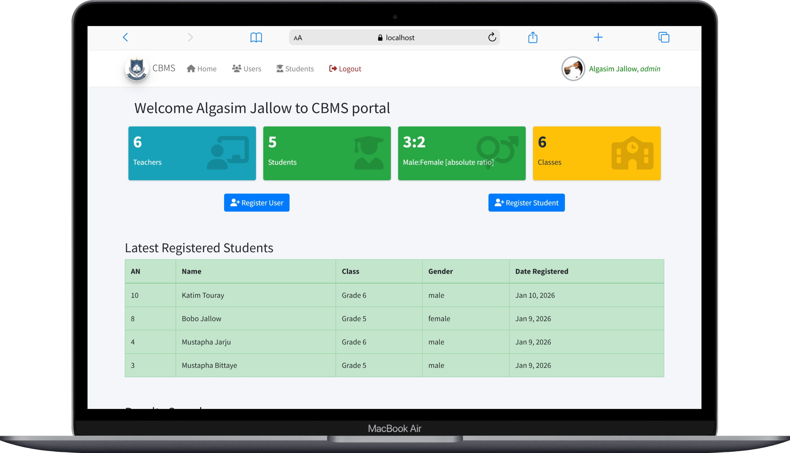
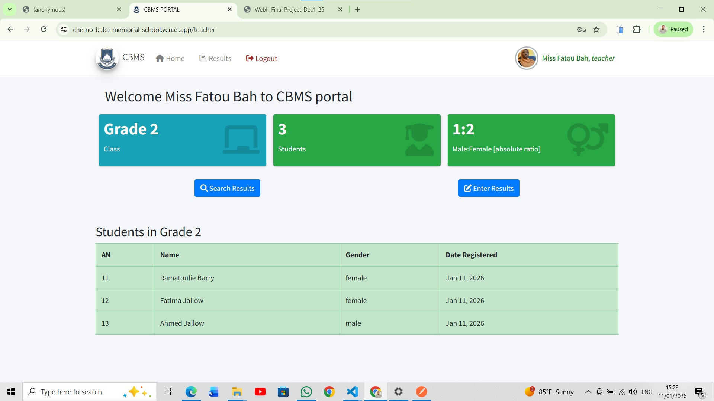
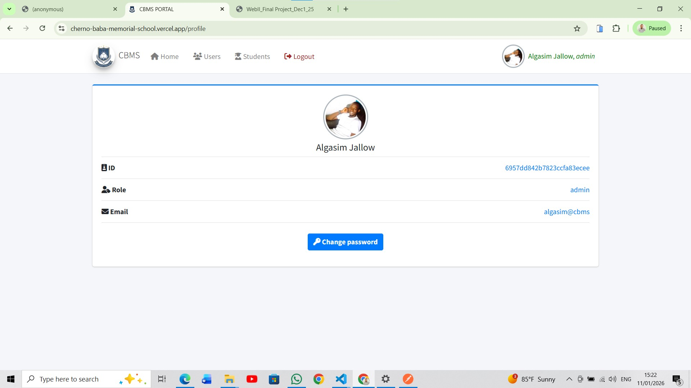
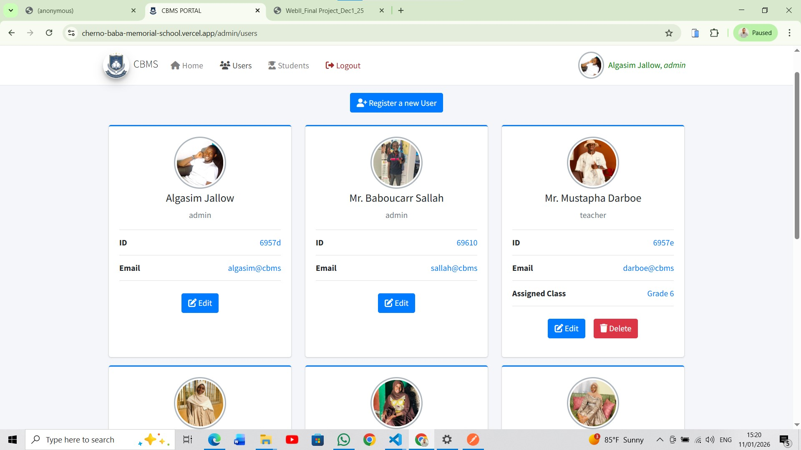
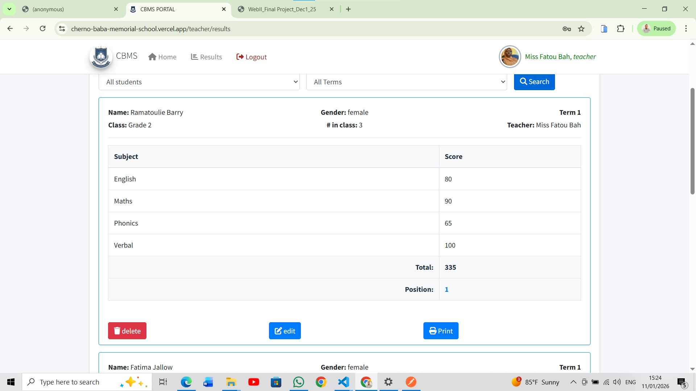

# Cherno Baba Memorial School (CBMS) Portal – Project Report

## 1. Project Overview and Purpose
This project builds a school management system for Cherno Baba Memorial School to manage students, teachers, results, and administration efficiently, with role-based access control. It’s a web application with separate interfaces for each role i.e. admin and teacher.

It aims to ease the responsibilities of teachers and admins in Cherno Baba School. "I know all your students and teachers. No more calculating totals and positions, just give me their marks and I provide you their results oh dear admin and teacher", says the system.

## 2. Features List
- Authentication & Authorization
- Admin and Teacher login
- Role-based route access
- Result generation
- Result printing
- User management, student management and results management (including search)

### Admin Features

- Search for students by name and class
- Register new students
- View and manage all users
- Search for results by student, term and/ or class.
- Dashboard overview

### Teacher Features
- Manage class results
- Generate student positions
- View results for their class only
- See all students in their class

### Shared Features
- User profile management (change password)
- Responsive UI with navigation bar

### Additional Features
- Access token for login sessions
- Refresh token for secure login sessions and refresh of access token when expired
- Error handling and notifications
- Error Page for page not found, server down or unautharized access.

## 3. Architecture / System Design
- Frontend: Angular (stand-alone components, routing, services, guards, interceptors)
- Backend: Node.js + Express
- Database: MongoDB
- Style: Mainly Bootstrap
- Authentication: JWT (access & refresh tokens)
- Routing & Guards: Route guards based on roles (admin/teacher)

### Data Models:
**User - Student - Result - counter(for tracking latest admission number) - RefreshToken**

## 4. API Endpoints Summary

### Authentication:
- **POST** /auth/login ==> login a user
- **POST** /auth/logout ==> logout user
- **POST** /auth/refresh ==> refresh access token
- **POST** /auth/register ==> to register a user

### Users (Admin Only):
- **GET** /users ==> get all users
- **GET** /users/:id ==> get a user
- **PUT** /users/:id ==> update user except password
- **DELETE** /users/:id ==> delete user
- **PATCH** /users/:id/password ==> update password

### Students
- **GET** /students ==> get all students
- **GET** /students/:id ==> get a student by ID
- **GET** /students/name ==> search for student by name
- **GET** /students/class/:classLevel ==>  get all students in a class
- **POST** /students ==> register new student
- **PUT** /students/:id ==> update student
- **DELETE** /students/:id ==> delete student

### Results
- **POST** /results ==> add result
- **GET** /results/search/:name ==> search for a result by name, class and term
- **GET** /results/class/:classLevel ==> get results in class
- **POST** /results/positions ==> generate positions for a class in a term
- **DELETE** /results/:id ==> delete result
- **PUT** /results/:id ==> edit result

## 5. Screenshots of Major Pages
Here are screenshot of the major pages.

### Login page

### Admin dashboard

### Teacher dashboard

### User profile pages

### Students Page

### Users Page

### Results  page

### Error Page

## 6. Challenges and Solutions

**Challenge:** Handling role-based access with multiple dashboards.  
**Solution:** Implemented Angular route guards with role validation.

**Challenge:** Ensuring correct student positions after result entry.  
**Solution:** Positions are recalculated each time a result is added.

**Challenge:** Frontend-backend integration with token-based authentication.  
**Solution:** Angular AuthService with JWT handling and HTTP interceptors.